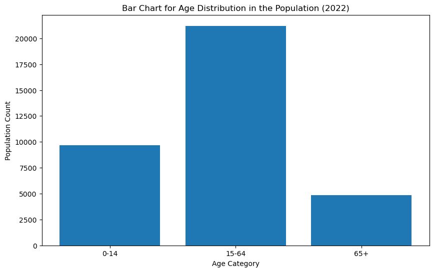

# 📊  Population Distribution by Age Group (2022)

This project fulfills **Task 01**:

> *"Create a bar chart to visualize the distribution of a categorical or continuous variable, such as the distribution of ages or genders in a population."*

We use **Python** and **Jupyter Notebook** to visualize the distribution of India’s population in 2022 across three main age groups:

* **0–14** (Children)
* **15–64** (Working-age population)
* **65+** (Elderly population)

---

## 📁 Dataset Information

* **Filename**: `India_Population_By_AgeGroup.csv`
* **Source**: World Bank Open Data

  * Indicators:

    * Total Population: `SP.POP.TOTL`
    * Age Structure (%): `0–14`, `15–64`, `65+`
* **Format**: Long (tidy) format – suitable for data visualization in Python.

---

## 🔢 Sample Data Preview

| Country | Year | Age Group | Population  |
| ------- | ---- | --------- | ----------- |
| India   | 2022 | 0–14      | 360,000,000 |
| India   | 2022 | 15–64     | 910,000,000 |
| India   | 2022 | 65+       | 100,000,000 |

---

## 🧪 Tools & Libraries Used

* `pandas` – for data manipulation
* `matplotlib` – for creating static plots
* `seaborn` – for enhanced visual styling
* `Jupyter Notebook` – for interactive coding and presentation

---

## 📈 Visualization Output

The following bar chart shows the distribution of India's population by age group (2022):




---

## 🎯 Key Insights

* The **15–64** group forms the largest portion of the population, suggesting a strong working-age demographic.
* The **0–14** group still makes up a significant share, indicating potential for future workforce growth.
* The **65+** population, while smaller, is expected to grow due to increasing life expectancy.

---

## ▶️ How to Run This Notebook

1. Clone or download this repository.
2. Make sure you have Python installed with the required libraries:

   ```bash
   pip install pandas matplotlib seaborn
   ```
3. Open the Jupyter Notebook:

   ```bash
   jupyter notebook SCT_DS_1.ipynb
   ```
4. Run all cells to load the data and view the visualization.

---

## ✅ Project Status

* [x] Dataset Imported
* [x] Data Filtered for 2022
* [x] Bar Chart Created using Seaborn
* [x] Task 01 Completed in Jupyter Notebook

---
